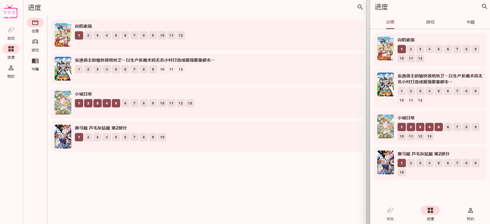
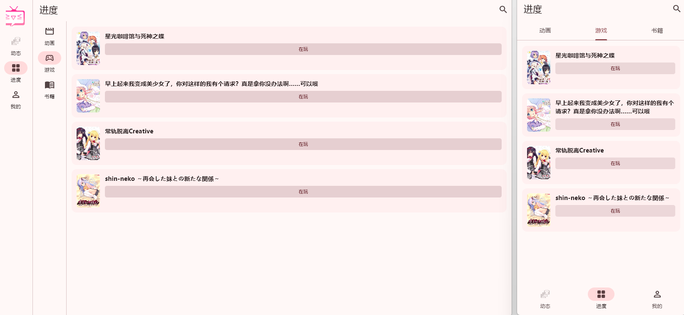
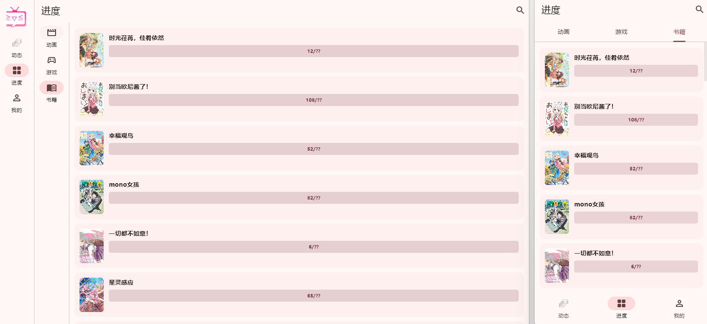
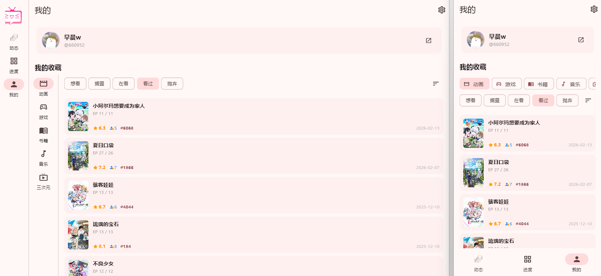
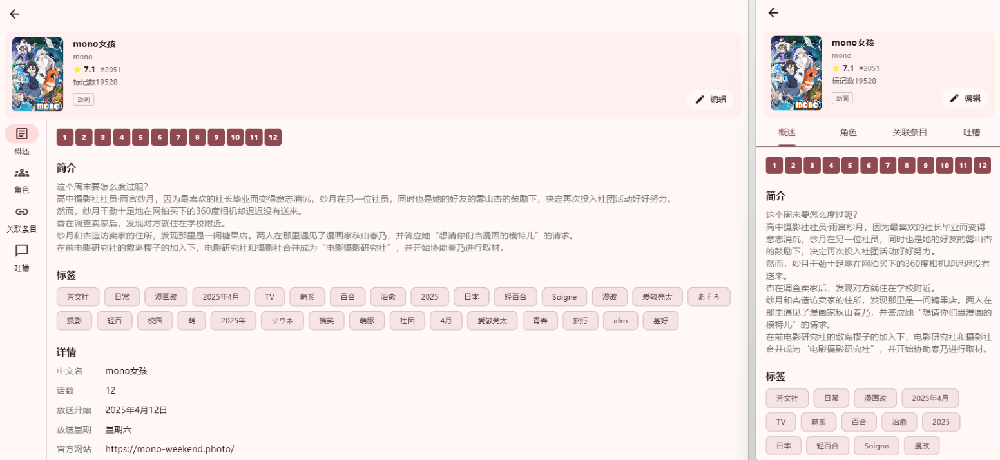
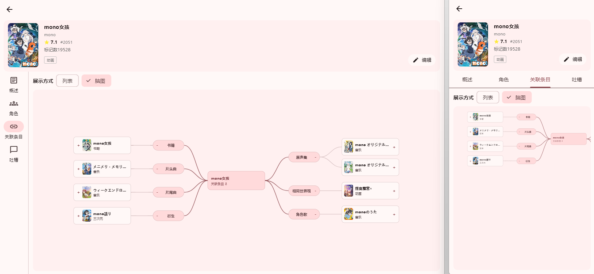
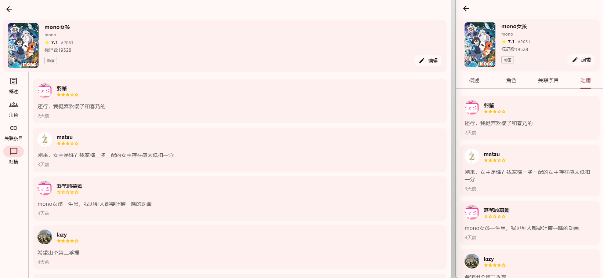
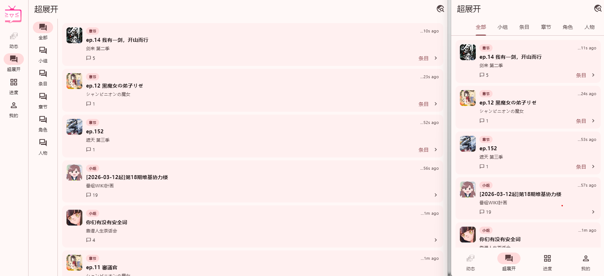
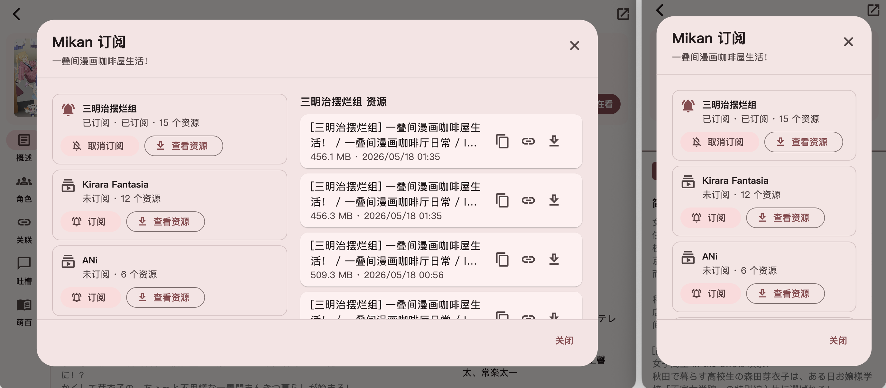
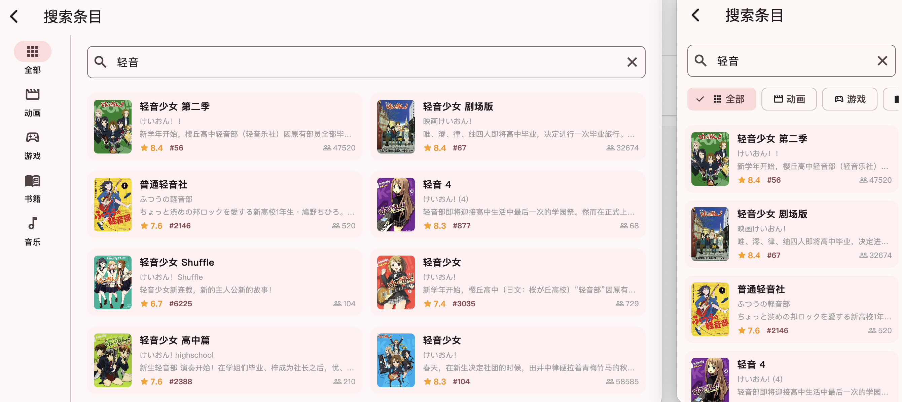

# ZcBangumi

基于 **Flutter** 开发的  **Bangumi 第三方客户端** ，专注于 ACG 条目浏览、收藏进度管理以及跨设备一致的使用体验。

在线体验：[bgm.greatzaochen.dev](https://bgm.greatzaochen.dev/)（受限于网页，仅有部分基础功能）

## 项目简介

ZcBangumi 致力于在保持 Bangumi 核心功能的基础上，提供更加**简洁、易用、流畅、清晰、现代化**的用户体验，并对部分页面展示方式进行了优化与改进。

## 功能特性

- **现代化页面设计**：界面风格简洁清晰，提升整体视觉体验。
- **流畅的使用体验**：内置缓存机制，部分内容支持离线加载。
- **Bangumi 镜像站**：在设置中选择官方站、`bangumi.vip` 或自定义镜像，统一切换网页、API 和图片线路，并支持手动验证。
- **多端与屏幕适配**：支持手机、平板与桌面端，并兼容横屏与竖屏使用场景。
- **页面体验优化**：对页面展示方式进行优化，如将关联条目以脑图形式展示，提升信息结构的可读性。
- **功能拓展**：利用班固米特性拓展更多功能，如超展开帖子收藏和收藏同步。补全使用体验。
- **多来源整合**：萌娘百科、蜜柑计划集成到应用中，可以快速查看百科和种子资源。
- **API 标签探索**：动画标签与条目详情标签统一使用公开 API，支持多标签组合、关键词与高级筛选，以及本地搜索记录和收藏的筛选。

## 标签探索

统一搜索页合并综合、条目、角色和人物搜索；条目范围使用 `POST /v0/search/subjects`，不再打开独立标签页或抓取 `/anime/tag` 网页。条目详情中的标签会携带原条目类型，支持动画、书籍、音乐、游戏和三次元，也可切换到全部类型。

每次输入一个标签，按回车或点击「＋」提交；继续添加即可组合检索，多个标签按「且」匹配。已提交标签可单独移除，空白和重复标签不会重复请求。标签名称按原样保留，不自动按逗号拆分。关键词可留空，也可与标签叠加；高级筛选复用搜索页的公共标签、日期、评分、评分人数、排名和 NSFW 条件。公共标签支持 `-标签` 排除，用户标签不提供排除语义。成人内容能否返回仍受 API 权限限制。

主界面保留关键词、标签、类型与排序；高级筛选只放公共标签、日期、评分、评分人数、排名和 NSFW 条件。结果卡片显示封面、标题与评分，全部类型下额外标注条目类型；完整资料进入条目详情查看。

从条目详情或收藏筛选打开的标签直接显示为已选标签。切换排序、类型或打开高级筛选不会提交仍在输入中的标签。全部类型下移除最后一个标签或重置全部筛选，会返回标签首页，不会向 API 发送空条件请求。

排序使用 API 的收藏热度、排名、评分和匹配程度，不再提供网页的日期／名称排序；日期范围只是筛选条件。收藏数与评分人数在数据模型中分别保留，评分人数可用于高级筛选。

公开 API 没有完整的动画标签目录接口。标签只通过手动输入逐个添加，不维护本地预置标签目录。最近搜索最多保留 20 条，收藏保存完整的类型、标签、关键词、排序与筛选条件，均仅存储在本地。

搜索接口由 Bangumi 标记为实验性，结果总数和排序以 API 实际返回为准，不保证与网页完全一致；失败时不会回退到 HTML 抓取。网页版依旧受所选 API 线路的浏览器跨域策略约束。

可使用 `flutter run -d chrome -t tools/tag_smoke.dart --no-pub` 或 `flutter run -d macos -t tools/tag_smoke.dart --no-pub` 隔离验收标签功能。此入口直接使用官方 API，将设置与标签记录保存在独立的 `tag_smoke.` 偏好命名空间，不读取正式应用的 Token、Cookie 或设置，不写入 Bangumi 账号数据。

## 截图展示

## 镜像站使用

在「设置 → 网络 → Bangumi 镜像站」选择线路并保存。自定义镜像填写 HTTPS 网页主域名，默认生成 `api`、`next`、`lain`、`fast` 子域名；高级选项可以分别覆盖服务根地址和端口，不支持路径式反代。

第三方镜像能够接触经由它发送的 Token、Cookie 及镜像页面内的登录信息。首次启用或修改服务地址必须确认风险，取消不会更换当前线路。网页版仍受浏览器跨域限制，切换镜像不等于解除这些限制。

「检查连接」只请求公开内容，不携带登录凭据，且会分别检查各服务的返回格式。展开「连接详情」查看各服务结果及验证入口；使用说明和验证会话清理位于卡片右上角的更多菜单。遇到人机验证时，在受支持的原生平台点击「验证」，自行完成页面操作后点击「验证完成，复测连接」。客户端复测通过才保存会话；代理出口或 User-Agent 不兼容时会提示失败。验证不会自动重放收藏、进度或发帖等写请求。

可使用 `flutter run -d macos -t tools/mirror_smoke.dart --no-pub` 进行隔离运行验收。此入口将设置保存在独立的 `mirror_smoke.` 偏好命名空间，不读取正式应用的 Token、Cookie 或设置，也不清理正式数据；隔离设置可以跨重启恢复。WebView 和公开图片仍使用应用现有的原生存储。

## macOS 开发要求

macOS 最低运行版本为 12.0。Runner 和 CocoaPods 的最低部署版本统一为 12.0；重新执行 `pod install` 时也会修正插件及隐私资源包中过旧的部署版本，不会降低依赖自身要求的更高版本。

使用 `flutter run -d macos` 启动调试，无须额外传入 `MACOSX_DEPLOYMENT_TARGET`。

## 统一阅读布局

普通页面统一使用 `ScrollAwareScaffold`，条目、人物与角色详情通过 `MonoDetailScaffold` 接入同一套 `ScrollAwareChrome`。不要在单个页面另写滚动方向判断或收起动画。

详情页及其加载态的顶部标签统一使用 `MonoDetailTabBar`：标签按文字宽度从左排列，不随窗口宽度等分拉伸；超出可视区域时支持触摸、鼠标拖动和横向滚轮滚动，切换标签会自动滚动到选中项。

条目、角色吐槽复用超展开原有的 `BangumiPostCard` / `BangumiPostBody`，评论数据通过 `BangumiPostData.fromComment` 转换。以超展开原样式为基准：用户名在左、楼层和本地绝对时间在右，主回复与楼中楼保留各自原有字号、行距、头像尺寸和缩进。条目评分保留五颗琥珀色星星，不改成数字评分徽章；评论专属的评分、剧透标记和回复数量仅按需展示，不改变超展开帖子样式。条目保留更新时间语义，角色保留发布时间语义。

用户头像统一使用 `BangumiAvatar`，包括个人资料、动态、目录作者、超展开、吐槽及楼中楼；加载占位使用 `BangumiAvatar.skeleton`。头像保持正方形，沿用超展开原有的圆角比例（边长的 24%），加载、缺图与失败状态同样裁剪。不要在页面里另写圆形头像或独立圆角规则，条目封面和角色、人物资料图片保持各自原有比例。

向下阅读时，工具栏精简为 48px，分类、标签与筛选区收起；向上轻微滚动或回到顶部时恢复。标题、返回与必要操作保留。首页顶部和底栏共享滚动状态及 200ms 动画，横屏左侧导航栏不隐藏。

正文上方的辅助控件使用 `ScrollChromeCollapse`；工具栏内的辅助选择器使用其横向模式。控件收起时不接收点击、焦点或无障碍操作，但保留自身状态。原生 WebView 通过 `ScrollAwareChrome.maybeOf(context)?.handleNativeScroll(y)` 接入相同规则。

## 致谢

本项目在开发过程中参考并受益于以下优秀项目：

* [Bangumi](https://bangumi.tv/)：提供数据接口与社区生态。
* [xiaoyvyv/bangumi](https://github.com/xiaoyvyv/bangumi)：优秀的 Bangumi 第三方客户端实现。
* [czy0729/Bangumi](https://github.com/czy0729/Bangumi)：提供了许多值得学习的实现思路。
* [iota9star/mikan_flutter](https://github.com/iota9star/mikan_flutter)：Mikan实现思路借鉴。
* [Flutter](https://flutter.dev/)：跨平台 UI 框架。

注：本项目在开发过程中广泛使用了 AI 辅助。
